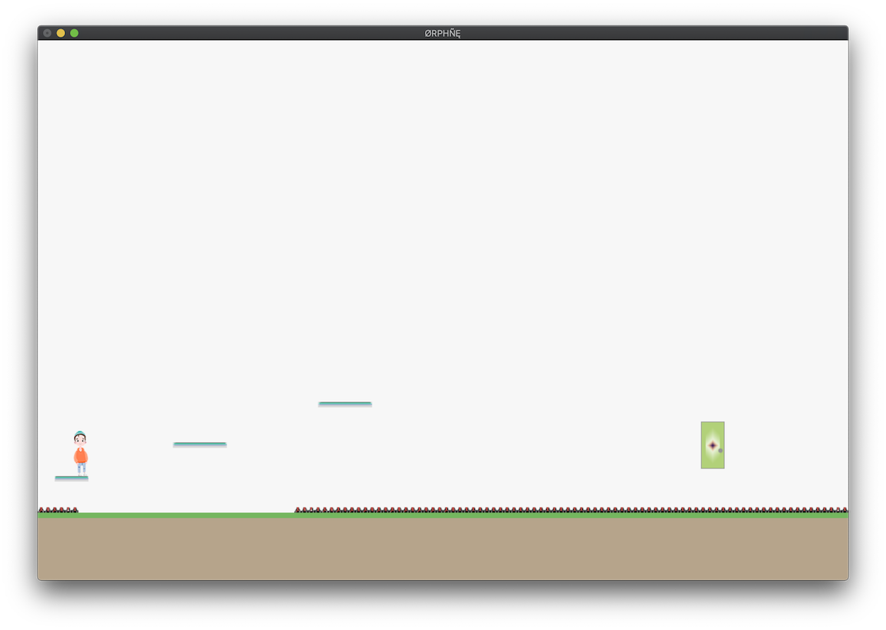

# orphne
 
**orphne** - платформер, написанный на языке программирования *Haskell*. 
 
 
 
## Stack

Для сборки проекта необходимо установить [утилиту Stack](https://www.haskellstack.org):

```
stack setup
```
## Зависимости, сборка и запуск

Также нужно установить библиотеку `gloss`, после чего можно собрать и запустить проект:

```
stack install gloss
stack build && stack exec orphne
```

Чтобы запустить интепретатор GHCi и автоматически подгрузить все модули проекта, используйте команду:

```
stack ghci
```

## Управление и сведения

На данный момент в игре 5 уровней c увеличивающейся сложностью, переход на следующий происходит после пересечения модельки персонажа с моделькой двери.

### Управление 

* `A` : движение в левую сторону;
* `D` : движение в правую сторону;
* `W` : прыжок.
 
Рестарт уровня происходит при нажатии кнопки `R`.

Так же предусмотрено переключение между уровнями на, соответственно, клавиши `1`, `2`, `3`, `4` и `5`.

Выйти из игры можно нажав `esc`.

## Благодарности

Отдельное спасибо **opsxolc** за персонажа.